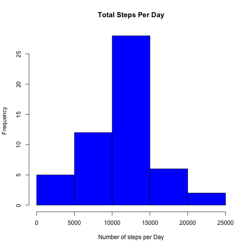
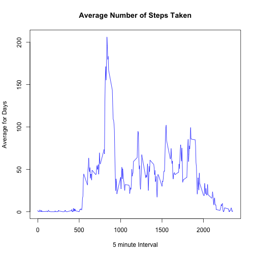
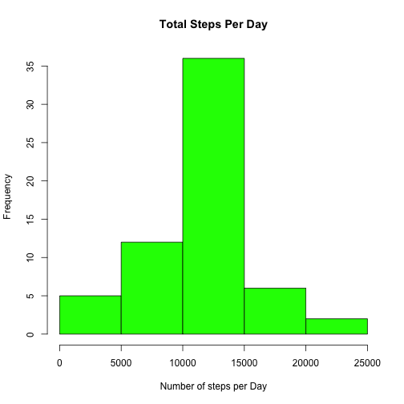
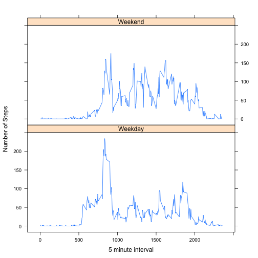

Reproducible Research: Peer Assessment 1
==================================================

## Loading and preprocessing the data
Reading the data.


```r
if(!file.exists('activity.csv')){
        unzip('activity.zip')
}
activityData <- read.csv('activity.csv')
names(activityData)
```

```
## [1] "steps"    "date"     "interval"
```

```r
head(activityData)
```

```
##   steps       date interval
## 1    NA 2012-10-01        0
## 2    NA 2012-10-01        5
## 3    NA 2012-10-01       10
## 4    NA 2012-10-01       15
## 5    NA 2012-10-01       20
## 6    NA 2012-10-01       25
```

Processing  the data to format the date column.

```r
activityData$date <- as.Date(activityData$date, "%Y-%m-%d")
```


## What is mean total number of steps taken per day?
First calculate total number of steps taken per day


```r
totalStepsPerDay <- aggregate(steps~date,data=activityData,sum,na.rm=TRUE)
```

Now the Histogram is :

```r
hist(totalStepsPerDay$steps,main="Total Steps Per Day",xlab="Number of steps per Day",col="blue")
```

 

Calculating Mean:

```r
stepsMean <- mean(totalStepsPerDay$steps)
```
Now the ***Mean*** is **10766.189**.

Calculating Median: 

```r
stepsMedian <- median(totalStepsPerDay$steps)
```
***Median*** is **10765**.

## What is the average daily activity pattern?
Make a time series plot (i.e type="l") of the 5 minute interval (x-axis) and the average number of steps taken, average across all days (y-axis)


```r
timeSeriesData <- aggregate(steps~interval,data=activityData,mean,na.rm=TRUE)
```
The plot for 5 minute interval and average number of steps taken are:


```r
plot(timeSeriesData$interval,timeSeriesData$steps,type="l",xlab="5 minute Interval",ylab="Average for Days",col="blue",main="Average Number of Steps Taken")
```

 

Which 5-minute interval, on average across all days in the dataset, contains the maximum number of steps


```r
max5MinInterval <-  timeSeriesData[which.max(timeSeriesData$steps),1]
```

The **835th** interval contain maximum number of steps.

## Imputing missing values
####1.Calculate and report the total number of NA in the dataset.

We will use **is.na** to check the NA values in the dataset and than we will use **Sum** to get the total number of NA's in the dataset.


```r
missingValSum <- sum(is.na(activityData))
```

Total number of ***missing values*** in the data set are **2304**.


####2. Strategy for filling NA with Values in the DataSet

Replace NA with mean in 5 min interval.


```r
stepsAverage <- aggregate(steps~interval,data=activityData,mean)
fillMissingVals <- numeric()
for(i in 1:nrow(activityData)){
        data <- activityData[i,]
        if(is.na(data$steps)){
                steps <- subset(stepsAverage,interval==data$interval)$steps
        }
        else{
                steps <- data$steps
        }
        fillMissingVals <- c(fillMissingVals,steps)
}
```

####3. Create new Dataset with filled missing values.

We will use **fillMissingVals** to create new dataset equal to original dataset with missing values filled.


```r
newActivityData <- activityData
newActivityData$steps <- fillMissingVals
head(newActivityData)
```

```
##       steps       date interval
## 1 1.7169811 2012-10-01        0
## 2 0.3396226 2012-10-01        5
## 3 0.1320755 2012-10-01       10
## 4 0.1509434 2012-10-01       15
## 5 0.0754717 2012-10-01       20
## 6 2.0943396 2012-10-01       25
```
Now just to confirm whether our new data set contain NA's or not.


```r
missVals <- sum(is.na(newActivityData))
missVals
```

```
## [1] 0
```
So Zero output shows that in our new data set there are ***NO NA's***.

####4. Histogram of total number of steps taken each day from our new dataset.


```r
totalStepsPerDay2 <- aggregate(steps~date,data=newActivityData,sum,na.rm=TRUE)
```

Now the Histogram is :

```r
hist(totalStepsPerDay2$steps,main="Total Steps Per Day",xlab="Number of steps per Day",col="green")
```

 

Calculating Mean:

```r
stepsMean2 <- mean(totalStepsPerDay2$steps)
```

Calculating Median: 

```r
stepsMedian2 <- median(totalStepsPerDay2$steps)
```


#### Do the  Mean and Median of new dataset differ from Mean and Median of original dataset.

- **Original dataset results**.    
        1. Mean is : ***10766.189***.  
        2. Median is : ***10765.***
        
- **New dataset results (after filling NA's)**.  
        1. Mean is : ***10766.189***.  
        2. Median is : ***10766.189***.
        
So we can see that after filling missing values the data mean is same and there is very minor difference in median.
        
## Are there differences in activity patterns between weekdays and weekends?

For this part we will use ***weekdays()*** function to check if the day is weekday or weekend. And we will create a new factor variable in the dataset with two levels weekday and weekend.


```r
day <- weekdays(activityData$date)
daylevel <- vector()
for(i in 1:nrow(activityData)){
        if(day[i] == "Saturday" || day[i] == "Sunday"){
                daylevel[i] = "Weekend"
        }else{
                daylevel[i] = "Weekday"
        }
}
activityData$daylevel <- daylevel
activityData$daylevel <- factor(activityData$daylevel)
head(activityData)
```

```
##   steps       date interval daylevel
## 1    NA 2012-10-01        0  Weekday
## 2    NA 2012-10-01        5  Weekday
## 3    NA 2012-10-01       10  Weekday
## 4    NA 2012-10-01       15  Weekday
## 5    NA 2012-10-01       20  Weekday
## 6    NA 2012-10-01       25  Weekday
```

```r
stepsEachDay <- aggregate(steps~interval+daylevel,data=activityData,mean)
head(stepsEachDay)
```

```
##   interval daylevel     steps
## 1        0  Weekday 2.3333333
## 2        5  Weekday 0.4615385
## 3       10  Weekday 0.1794872
## 4       15  Weekday 0.2051282
## 5       20  Weekday 0.1025641
## 6       25  Weekday 1.5128205
```

Make a panel plot containing a time series plot (i.e. type = ???l???) of the 5-minute interval (x-axis) and the average number of steps taken, averaged across all weekday days or weekend days (y-axis). The plot should look something like the following, which was creating using simulated data:


```r
library(lattice)
xyplot(steps~interval | daylevel,stepsEachDay,type="l",layout =c (1,2),xlab="5 minute interval",ylab="Number of Steps")
```

 
